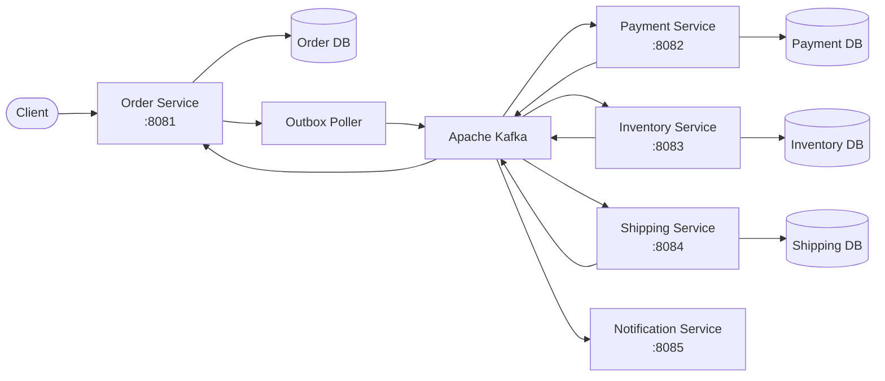
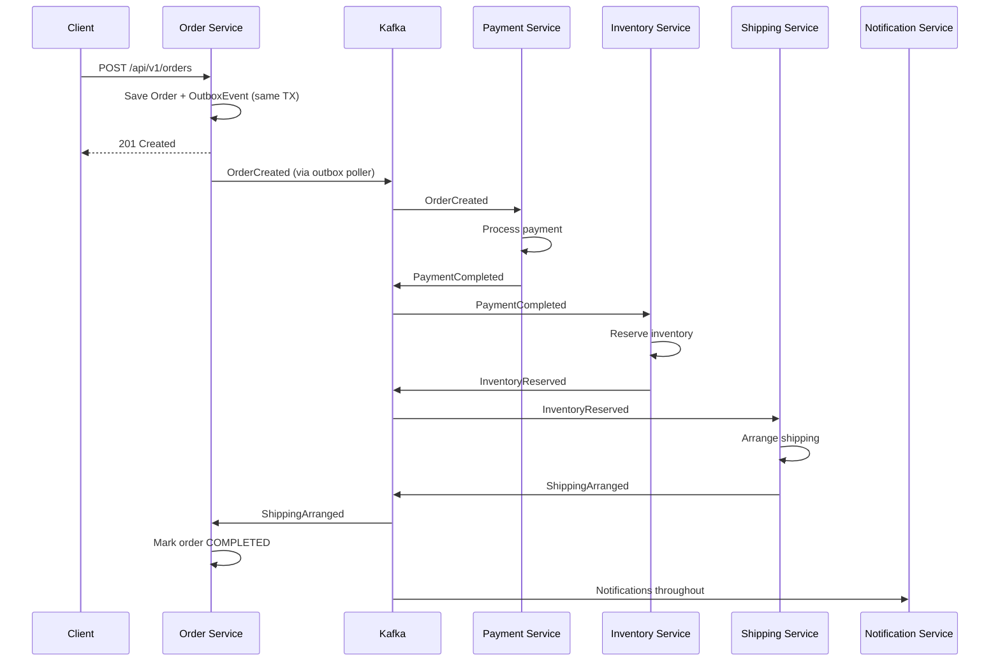

# Event-Driven Order Processing Platform

A production-style event-driven microservices platform demonstrating the Saga pattern, transactional outbox, idempotent consumers, Kafka-based eventual consistency, compensation/rollback, and per-service data isolation.

## Why I Built This

Distributed transactions are one of the hardest problems in microservices. This project explores how production systems handle multi-service consistency without two-phase commit — using choreography-based sagas, event-driven communication, and compensation patterns that allow reliable order processing even when individual services fail.

## Architecture



### Saga Flow



## Key Engineering Patterns

| Pattern | Where |
|---------|-------|
| **Saga (Choreography)** | order-service coordinates via Kafka events |
| **Transactional Outbox** | order-service writes events to DB, poller publishes to Kafka |
| **Idempotent Consumers** | All services use unique constraints to prevent duplicates |
| **Compensation/Rollback** | Payment refund, inventory release on failure |
| **Database-per-Service** | Each service owns its PostgreSQL database |
| **Event-Driven Architecture** | All inter-service communication via Kafka |
| **Optimistic Locking** | JPA `@Version` on all aggregate roots |
| **Correlation IDs** | Track requests across all services |

## Tech Stack

- **Java 21** + **Spring Boot 3.2** (5 microservices)
- **Apache Kafka** (KRaft mode) for event messaging
- **PostgreSQL 16** with Flyway migrations (database-per-service)
- **Micrometer** + Prometheus + Grafana for observability
- **JUnit 5** + Mockito for testing
- **Docker Compose** for local development
- **GitHub Actions** CI/CD

## Quick Start

### Prerequisites
- Java 21+, Maven 3.9+, Docker

### 1. Start Infrastructure
```bash
make infra-up
```

### 2. Build All Services
```bash
make build
```

### 3. Start Services (separate terminals)
```bash
cd order-service && mvn spring-boot:run
cd payment-service && mvn spring-boot:run
cd inventory-service && mvn spring-boot:run
cd shipping-service && mvn spring-boot:run
cd notification-service && mvn spring-boot:run
```

### 4. Place an Order
```bash
make sample-order
```

### 5. Check Order Status
```bash
curl -s http://localhost:8081/api/v1/orders/{order-id} | jq .
```

## Project Structure

```
├── common-events/           # Shared event contracts
├── order-service/           # Saga orchestrator + transactional outbox
├── payment-service/         # Payment processing + refund compensation
├── inventory-service/       # Stock reservation + release compensation
├── shipping-service/        # Shipment creation
├── notification-service/    # Customer notifications
├── docker/                  # Prometheus config
├── scripts/                 # DB initialization
├── docs/                    # Architecture docs + ADRs
└── docker-compose.yml       # Full local dev stack
```

## Service Ports

| Service | Port | Health |
|---------|------|--------|
| Order | 8081 | http://localhost:8081/actuator/health |
| Payment | 8082 | http://localhost:8082/actuator/health |
| Inventory | 8083 | http://localhost:8083/actuator/health |
| Shipping | 8084 | http://localhost:8084/actuator/health |
| Notification | 8085 | http://localhost:8085/actuator/health |
| Kafka UI | 8090 | http://localhost:8090 |
| Prometheus | 9090 | http://localhost:9090 |
| Grafana | 3000 | http://localhost:3000 |

## Design Decisions

See [docs/decisions/](docs/decisions/) for Architecture Decision Records.

## License

MIT
