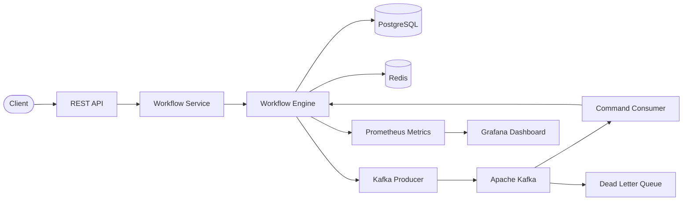
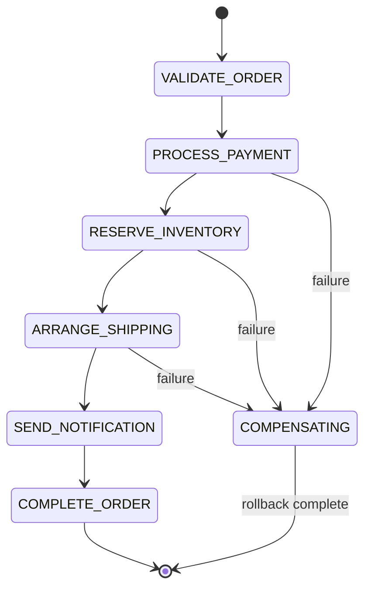

# Workflow Orchestration Platform

A production-style distributed workflow orchestration engine demonstrating state machine lifecycle, idempotent commands, Kafka-based event processing, saga compensation/rollback, retry with exponential backoff, dead letter queues, optimistic locking, and full observability.

## Why I Built This

Modern backend systems require reliable, asynchronous workflow execution that can survive partial failures, duplicate messages, and concurrent access. This project explores the engineering patterns behind production workflow orchestrators — state machines, idempotency, compensation, and observability — without coupling to any proprietary system.

The order fulfillment domain (validate → pay → reserve → ship → notify → complete) provides a realistic context for demonstrating these distributed systems concepts.

## Architecture



### Workflow Step Pipeline



## Key Engineering Patterns

| Pattern | Implementation |
|---------|---------------|
| **State Machine** | `WorkflowStatus` enum with enforced valid transitions |
| **Idempotent Commands** | Redis-backed deduplication via `IdempotencyService` |
| **Optimistic Locking** | JPA `@Version` on `WorkflowInstance` prevents lost updates |
| **Saga Compensation** | Reverse-order step rollback when downstream steps fail |
| **Retry + Backoff** | Per-step retry with configurable max attempts |
| **Dead Letter Queue** | Failed messages routed to Kafka DLQ topic |
| **Event Sourcing (Audit)** | Every state transition recorded as `WorkflowEvent` |
| **Structured Logging** | Correlation IDs, trace IDs, and structured context |
| **Observability** | Prometheus counters/timers, Grafana dashboards |

## Tech Stack

- **Java 21** + **Spring Boot 3.2**
- **Apache Kafka** (KRaft mode, no Zookeeper)
- **PostgreSQL 16** with Flyway migrations
- **Redis 7** for idempotency cache
- **Micrometer** + Prometheus + Grafana for metrics
- **OpenTelemetry** for distributed tracing
- **JUnit 5** + Mockito + Testcontainers
- **Docker Compose** for local development

## Quick Start

### Prerequisites

- Java 21+
- Maven 3.9+
- Docker & Docker Compose

### 1. Start Infrastructure

```bash
make infra-up
```

### 2. Build and Run

```bash
make build
make run
```

### 3. Create a Workflow

```bash
curl -s -X POST http://localhost:8080/api/v1/workflows \
  -H "Content-Type: application/json" \
  -d '{
    "correlationId": "order-001",
    "payload": "{\"orderId\":\"ORD-001\",\"customerId\":\"CUST-001\",\"totalAmount\":249.99,\"customerEmail\":\"customer@example.com\",\"items\":[{\"sku\":\"LAPTOP-PRO-15\",\"quantity\":1,\"price\":249.99}]}"
  }' | jq .
```

### 4. Check Workflow Status

```bash
curl -s http://localhost:8080/api/v1/workflows/{workflow-id} | jq .
```

### 5. View Metrics

- Prometheus: http://localhost:9090
- Grafana: http://localhost:3000 (admin/admin)
- Swagger UI: http://localhost:8080/swagger-ui.html

## API Reference

| Method | Endpoint | Description |
|--------|----------|-------------|
| `POST` | `/api/v1/workflows` | Create workflow (idempotent) |
| `GET` | `/api/v1/workflows/{id}` | Get workflow by ID |
| `GET` | `/api/v1/workflows` | List workflows (paginated) |
| `POST` | `/api/v1/workflows/{id}/cancel` | Cancel a workflow |
| `GET` | `/api/v1/workflows/stats` | Get statistics |
| `GET` | `/actuator/health` | Health check |
| `GET` | `/actuator/prometheus` | Prometheus metrics |

## Project Structure

```
├── src/main/java/com/nexaforge/workflow/
│   ├── config/              # Spring configuration
│   ├── controller/          # REST controllers and DTOs
│   ├── domain/
│   │   ├── enums/           # WorkflowStatus, StepStatus, StepType
│   │   ├── event/           # Kafka event records
│   │   └── model/           # JPA entities (WorkflowInstance, WorkflowStep, WorkflowEvent)
│   ├── exception/           # Domain exceptions
│   ├── kafka/
│   │   ├── config/          # Topic creation
│   │   ├── consumer/        # Command consumer with manual ACK
│   │   └── producer/        # Event/command producer
│   ├── repository/          # Spring Data JPA repositories
│   └── service/
│       ├── engine/          # WorkflowEngine, StepExecutor interface
│       └── engine/steps/    # Step implementations (validate, pay, reserve, ship, notify, complete)
├── src/main/resources/
│   ├── application.yml
│   └── db/migration/        # Flyway SQL migrations
├── src/test/                # Unit and integration tests
├── docker/                  # Dockerfile, Prometheus config
├── docs/                    # Architecture, API, ADRs
└── docker-compose.yml       # Full local dev stack
```

## Design Decisions

See [docs/decisions/](docs/decisions/) for Architecture Decision Records (ADRs).

## Testing

```bash
make test              # Unit tests
make integration-test  # Integration tests (Testcontainers)
make verify            # Build + all tests
```

## License

MIT
